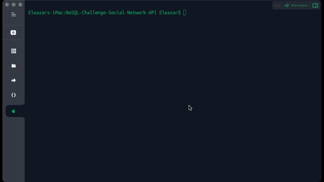

# NoSQL-Challenge-Social-Network-API
Developed a MongoDB &amp; Express-based social network backend enabling users to share thoughts, react to friends' posts, and manage friend lists. Express.js handled routing, and MongoDB served as the database.

## Table of Contents
* [Description](#description)
* [Install](#install)
* [Use](#use)

## Description
The task at hand is to develop an API for a social networking web platform, offering users the ability to post their thoughts, interact with the thoughts of their friends, and manage a list of friends. The project leverages Express.js for managing routes, a MongoDB database for data storage, and the Mongoose Object Data Modeling (ODM) library for efficient database interaction. While crafting this solution, you have the flexibility to incorporate either the built-in JavaScript Date object or opt for a third-party JavaScript date library to handle timestamp formatting. This comprehensive technology stack empowers you to create a feature-rich and seamless social network API.

## Install
* Clone the project source code

* To verify Node.js installation, type "node -v" in your command line. If Node is absent, access the Node.js website for installation. Run the following line of code in your terminal to install all the needed packages: 
```
npm i 
```

* Start the application’s server and syncs sequelize models to a MySQL database on the server start.
```
npm start
```


## Use
* Demonstration 1.  

  

* Demonstration 2.  

 

* Demonstration 3.  

